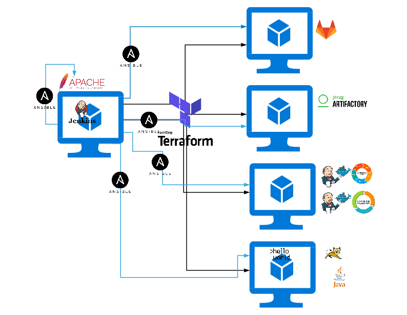

# devops-app-terraform

Code Terraform pour le projet "Pipeline CI / CD en automatique"

Réalisé par Massine

# Architecture du projet



# Code terraform_devops-app-01

```
En pré-projet, l'instance devops-app-01 a été terraformée à l'aide du code terraform_devops-app-01.
Cette instance a été provisionnée (de manière semi-automatique) avec un service Jenkins et les outils git, Terraform et Ansible pour la suite du projet.
```

# Code terraform_devops-app-02-05

```
Ce code est appelé par le service Jenkins pour générer automatiquemt l'infrastructure relative aux instances devops-app-02 à devops-app-05
```

# Jenkinsfile

```
Le Jenkinsfile applique un script shell qui lance les commandes terraform nécessaires pour la gestion des instances (terraform apply pour créer les instances, ou terraform destroy pour les détruire)
```
